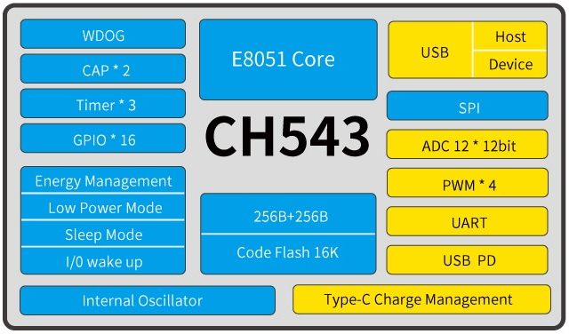

# [CH543](https://www.soc.xin/CH543)

* [WCH](http://www.wch.cn/)：[MCS-51](https://github.com/SoCXin/MCS-51)
* [L1R2](https://github.com/SoCXin/Level)：48 MHz

## [简介](https://www.soc.xin/CH543)

[CH543](http://www.wch.cn/products/CH543.html) 是一款兼容 MCS51指令集的USB和USB PD增强型E8051内核MCU，79%的指令是单字节单周期指令，运行速度快。内置16K程序存储器 Flash-ROM和256字节内部iRAM以及 256字节片内xRAM， xRAM支持DMA直接内存存取。 CH543内置了USB Power Delivery控制器和PD BMC PHY收发器，支持 USB type C、BC、PD2.0、PD3.0、PPS，支持12V高压电源，作为PMIC用于电源管理、受电端、供电端、DRP。 CH543内置了USB主机控制器和收发器，支持全速和低速USB Host主机和USB Device设备。 CH543 还内置了12位ADC模数转换、电容式触摸按键检测模块、内置时钟、3组定时器和2路信号捕捉、4路PWM、异步串口、SPI、I2C 从机、可编程灌电流模块等功能模块

### 关键参数

* 48 MHz MCS-51 Core (增强型E8051内核CPU，特有XRAM数据快速复制指令，双DPTR指针)
* 256B IRAM + 256B xRAM + 16KB FLASH
* 内嵌USB控制器和USB收发器，支持USB2.0全速和低速主机或设备，支持DMA。USB端口支持BC充电协议。
* 提供USB Power Delivery控制器和PD收发器PHY，支持USB PD2.0和 PD3.0电力传输控制，支持 DRP。
* ISINK：512 级可编程灌电流，相当于 9 位 DAC，支持 PPS。
* P3.5引脚支持VDD12高压12V 输入输出，RST引脚作为通用输入支持 VDD12高压12V。
* 内置12V到3.3V或4.7V的低压差电压调整器，用于USB和I/O及 ADC 等模块，VDD12支持5V或3.3V或9V甚至12V或2.8V电源电压。
* 小封装 (TSSOP20/SOP16/ESSOP10/QFN20)

## [资源收录](https://github.com/SoCXin)

* [参考资源](src/)
* [参考文档](docs/)
* [参考工程](project/)

## [选型建议](https://github.com/SoCXin)

[CH543](https://item.taobao.com/item.htm?spm=a230r.1.14.18.6f9b2125UQ7Zbg&id=672919328816&ns=1&abbucket=6#detail)

